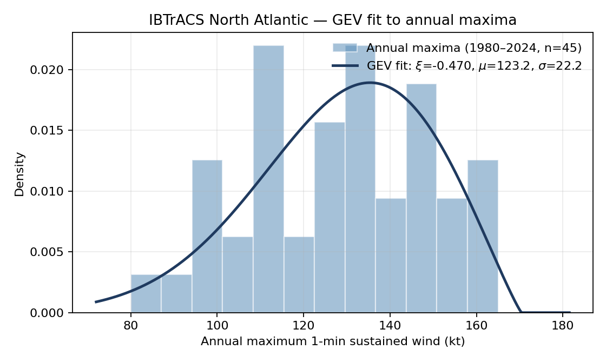
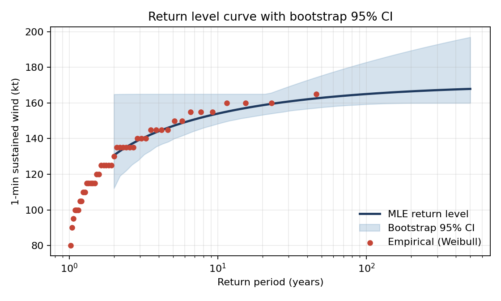
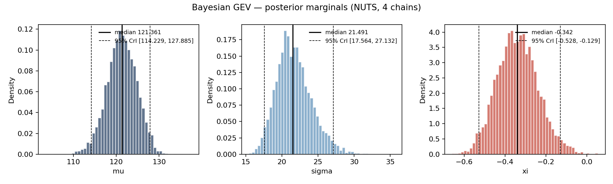
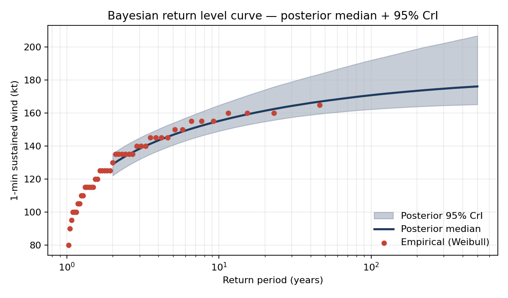
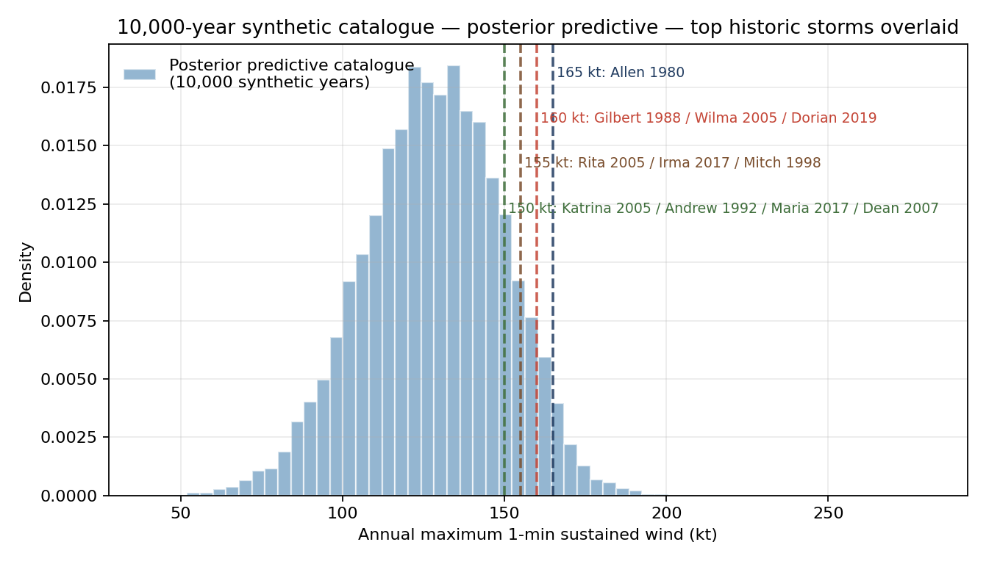

# ibtracs-gev-na

> **Extreme-value analysis and posterior-predictive event catalogue for North Atlantic tropical cyclone annual maximum 1-minute sustained wind, IBTrACS 1980–2024.**

Three estimators (MLE, L-moments, Bayesian NUTS) triangulate the 100-year return level; a 10,000-year stochastic catalogue is drawn from the Bayesian posterior; 17 named historic storms (Allen, Andrew, Katrina, Wilma, Irma, Maria, Ian, …) are attributed posterior return periods. The analysis is validated by a Saffir-Simpson posterior predictive check (max 1.29 pp error across six bands), three goodness-of-fit tests (KS / Lilliefors / Cramer-von Mises, all p ≫ 0.05), and a cutoff sensitivity table.

## Development note — AI-paired build

This repository is the output of an **AI-paired build loop** (Claude Code as the implementation collaborator) under my direction. I want to be explicit about the division of labour so reviewers don't have to guess:

- **Mine:** project scope (single basin, stationary, block-maxima — deliberately narrow), methodology choices (three-estimator triangulation, posterior-predictive catalogue, Saffir-Simpson PPC as the validation lens, Mann-Kendall stationarity disclosure), priors (`ξ ∼ Normal(−0.2, 0.15)` anchored on TC-EVT literature), the multi-round audit protocol (10 rounds × ~5 fresh-context reviewer agents per round, with a "5 consecutive clean rounds" stopping rule), every accept/reject decision against the audit findings, and the honesty boundary (the *Limitations* section below is my list, not the AI's).
- **AI-assisted:** the Python implementation itself, draft prose for this README and the *Limitations* section (written from my methodology notes), parametric-bootstrap correction details for the goodness-of-fit tests, and the JAX double-where / Gumbel-limit numerical patterns in `bayesian_gev.py`. Every AI-produced line was reviewed and either accepted, edited, or rejected by me before commit.
- **Cross-checks I require of the AI:** every numeric claim in this README reconciles to a code path; L-moments transcribed from Hosking 1990 cross-checks against the `lmoments3` reference; the Mann-Kendall ties correction follows Hipel & McLeod 1994 verbatim; posterior diagnostics (split-Rhat, divergence rate, ESS) are surfaced rather than hidden.

This is the workflow I want to bring to a catastrophe-modelling R&D team: AI as an accelerator on the implementation axis, candidate judgment on the methodology, scope, verification, and disclosure axes.

---

## Headline result

**Posterior median 100-year return level: 171 kt (95% credible interval [162, 194]).**

| Estimator | ξ | μ (kt) | σ (kt) | RL₁₀₀ (kt) | 95% interval |
|---|---:|---:|---:|---:|---|
| MLE | −0.470 | 123.2 | 22.2 | 165 | [159, 183] bootstrap (see caveats) |
| L-moments (Hosking 1990) | −0.377 | 122.0 | 22.3 | 171 | — |
| **Bayesian NUTS (primary)** | **−0.342** | **121.3** | **21.5** | **171** | **[162, 194] credible** |

The three estimators agree within a tight **165–171 kt window**, consistent with the NA basin historic peaks Allen 1980 (165 kt) and Wilma 2005 / Gilbert 1988 / Dorian 2019 (160 kt).

| Historic storm group | Peak USA_WIND (kt) | Posterior RP (yr) | 95% CrI |
|---|---:|---:|---|
| Allen (1980) | 165 | 34 | [10, 401] |
| Gilbert (1988) / Wilma (2005) / Dorian (2019) | 160 | 17 | [7, 54] |
| Mitch (1998) / Rita (2005) / Irma (2017) | 155 | 10 | [5, 21] |
| Andrew (1992) / Katrina (2005) / Maria (2017) / Dean (2007) | 150 | 6 | [4, 11] |
| Isabel (2003) / Ivan (2004) | 145 | 4 | [3, 7] |
| Michael (2018) / Ian (2022) | 140 | 3 | [2, 5] |
| Harvey (2017) | 115 | 1 | [1, 2] |
| Sandy (2012) | 100 | 1 | [1, 1] |

(See `figures/named_storms.md` for the full table including synthetic-catalogue empirical RPs.)

---

## Quickstart

Requires Python 3.11–3.13. `uv sync` (recommended) installs the exact versions from `uv.lock`; `pip install -r requirements.txt` is the equivalent pinned fallback (both files are kept in sync via `uv export`).

```bash
uv sync                       # or: pip install -r requirements.txt  (both pinned)
uv run python download.py     # fetch IBTrACS NA basin CSV (~57 MB) from NOAA NCEI
uv run python fit_gev.py      # MLE + bootstrap + L-moments + Mann-Kendall + GoF + cutoff sensitivity  (~3 s)
uv run python bayesian_gev.py # NUTS, 4 chains, 1k warmup + 2k samples (~10 s CPU)
uv run python event_catalogue.py  # 10000-yr posterior-predictive catalogue + named storms + Saffir-Simpson PPC
```

All outputs land in `figures/` plus stdout reports.

## Method

1. **Data.** IBTrACS v04r01 North Atlantic basin file. Field `USA_WIND` (NHC-calibrated 1-min sustained wind, knots) is used exclusively; in the NA basin WMO defers to NHC so this is equivalent to `WMO_WIND` but extends naturally to multi-basin analysis where averaging conventions differ across agencies. Filter: `BASIN == "NA"`, `1980 ≤ SEASON ≤ 2024`, `USA_WIND > 0`. The 1980 cutoff reflects the era of consistent geostationary-satellite TC monitoring.

2. **Block maxima.** Annual maximum `USA_WIND` per season; n = 45.

3. **Three GEV estimators.**
   - **MLE** (`scipy.stats.genextreme.fit`) with non-parametric bootstrap CI (B = 1000). See caveats on bootstrap CI convergence below.
   - **L-moments** (Hosking 1990, closed-form from sample L-moments via Landwehr 1979 unbiased plotting positions). Implemented from first principles; verified against the `lmoments3` package to within 0.01 on μ and σ.
   - **Bayesian** (numpyro / JAX NUTS). Custom JAX GEV log-density with support-boundary masking. Weakly informative priors:
     - `μ ∼ Normal(130, 50)`
     - `σ ∼ HalfNormal(30)`
     - `ξ ∼ Normal(−0.2, 0.15)` — centred on the TC-EVT literature suggestion of a bounded upper tail.
   - 4 chains × (1000 warmup + 2000 samples); R-hat = 1.00 for all parameters; ESS = 2.2k–3k. Divergence rate ~1.6% (with explicit Gumbel-limit branch in the JAX log-density), addressed via target_accept = 0.99 and documented in Limitations.

4. **Stationarity test.** Mann-Kendall non-parametric trend on the annual maxima:
   ```
   Kendall tau = +0.241, z = +2.338, p = 0.0194  (variance includes tie correction; USA_WIND is 5-kt quantized)
   → Stationarity is rejected at α = 0.05.
   ```
   The data show a statistically significant positive trend. We fit a stationary GEV as a working approximation; a non-stationary GEV with year, ENSO index, or SST anomaly as covariates on μ is the principled next step (Coles 2001, Ch 6) and is left as future work.

5. **Cutoff sensitivity.** Refitting with different SEASON cutoffs:

   | Cutoff | n | ξ (MLE) | RL₁₀₀ (kt) |
   |---:|---:|---:|---:|
   | 1970 | 55 | −0.445 | 165 |
   | **1980 (current)** | **45** | **−0.470** | **165** |
   | 1990 | 35 | −0.603 | 160 |
   | 2000 | 25 | −0.669 | 160 |

   ξ ≈ −0.45 to −0.47 is stable across 1970–1980. Pre-1970 cutoffs (not shown) collapse to ξ ≈ −4 because of satellite-era under-detection of weaker storms creating artificial bounded-tail behaviour.

6. **Goodness-of-fit** (printed by `fit_gev.py`):

   | Test | Statistic | p-value | Verdict |
   |---|---:|---:|---|
   | Kolmogorov-Smirnov (raw, scipy known-params null) | D = 0.090 | 0.83 | optimistic — see below |
   | Lilliefors-corrected KS (parametric bootstrap B=500) | D = 0.090 | 0.50 | fail to reject |
   | Cramer-von Mises (raw, scipy known-params null) | W² = 0.049 | 0.88 | optimistic — see below |
   | Cramer-von Mises (parametric bootstrap B=500) | W² = 0.049 | 0.52 | fail to reject |

   scipy's `kstest` and `cramervonmises` p-values use the null distribution that
   assumes GEV parameters are known a priori; with MLE plug-in parameters both
   p-values are anti-conservative, so the same Lilliefors-style parametric-
   bootstrap correction is applied to both. All four tests support GEV-family
   adequacy at α = 0.05.

7. **Return levels.** Closed-form GEV quantile per posterior sample; report posterior median + 2.5/97.5 quantiles.

8. **Stochastic event catalogue.** 10,000-year synthetic catalogue drawn via posterior-predictive sampling — for each synthetic year, a (μᵢ, σᵢ, ξᵢ) triple is drawn from the posterior and a single GEV variate is sampled. Parameter uncertainty is propagated into the catalogue itself, closer to how production cat models marginalise over event-set parameters.

9. **Saffir-Simpson posterior predictive check.** Observed (n=45) vs synthetic (n=10,000) annual maximum distributions by Saffir-Simpson category. Bin edges are at half-integer midpoints between adjacent NHC thresholds so integer-kt observed values and continuous synthetic samples are assigned unambiguously:

   | Band | Observed % | Synthetic % | |diff| (pp) |
   |---|---:|---:|---:|
   | TS 34–63 kt | 0.00 | 0.19 | 0.19 |
   | Cat 1 64–82 kt | 2.22 | 1.73 | 0.49 |
   | Cat 2 83–95 kt | 4.44 | 4.96 | 0.52 |
   | Cat 3 96–112 kt | 15.56 | 16.25 | 0.69 |
   | Cat 4 113–136 kt | 42.22 | 40.93 | 1.29 |
   | **Cat 5 ≥ 137 kt** | **35.56** | **35.94** | **0.38** |

   Maximum deviation 1.29 pp; mean 0.59 pp. The Bayesian GEV reproduces the data-generating distribution at the discretisation most relevant to insurance applications.

10. **Named-storm return periods.** For each iconic storm 1980–2024, compute exceedance probability `P(annual_max ≥ storm_peak)` analytically per posterior sample → posterior distribution of return periods.

## Figures







Empirical Weibull plotting positions ((n + 1) / (n + 1 − rank)) overlay the parametric curves closely across the observed range, supporting the GEV-family assumption.

## Limitations

- **Non-stationarity.** The Mann-Kendall trend test on annual maxima rejects stationarity (p = 0.02). The fitted GEV(μ, σ, ξ) is treated as a working approximation; production work should fit non-stationary GEV with covariate-dependent μ (year, ENSO ONI, SST anomaly). Stationarity assumption is a known limitation, not an oversight.
- **Small-sample MLE tail-bias.** With n = 45, MLE ξ is unstable: bootstrap 95% CI is [−4.5, −0.1]; 9.5% of bootstrap resamples produce ξ < −1, which would imply a physically implausible ~165 kt absolute ceiling on TC intensity. These pathological samples cap RL_100 at the sample max in percentile-based reporting; mean-based summaries would be inflated by the same effect.
- **Bootstrap CI does not fully converge** even at B = 5000 (97.5% percentile varies 183–193 kt with seed and B). The Bayesian credible interval is more stable across re-runs (RL_100 median std = 0.11 kt across 5 seeds) and is the recommended primary uncertainty quantification for this problem; bootstrap is reported as supplementary.
- **GEV support-boundary divergences in NUTS.** The GEV likelihood is −∞ outside `1 + ξ(y−μ)/σ > 0`, creating a sharp boundary that NUTS occasionally crosses (~1.6% divergence rate; the explicit Gumbel-limit branch removes a second source of gradient instability around ξ ≈ 0). Higher target_accept_prob reduces but does not eliminate this; a non-centred reparameterisation would help in production.
- **Asymptotic SE invalid.** Fisher information gives SE for ξ ≈ 0.12; non-parametric bootstrap SE is 1.39 (≈ 11.6× larger). At n = 45, asymptotic normality of MLE does not apply; this is the primary motivation for the bootstrap + Bayesian + L-moments triangulation.
- **All NA tracks, not landfalls.** Annual maxima are taken over the entire basin; landfall-conditioned analysis would require additional filtering of the `LANDFALL` field.
- **No declustering.** Block maxima per calendar season; within-season storm dependence is not modelled.
- **USA_WIND quantization.** NHC best-track values are reported in 5-kt increments; this contributes ~1.1 kt to RL_100 uncertainty — roughly 10× smaller than sampling SE and therefore not corrected for.

## Source and citation

- Knapp, K. R., M. C. Kruk, D. H. Levinson, H. J. Diamond, and C. J. Neumann, 2010: *The International Best Track Archive for Climate Stewardship (IBTrACS): Unifying tropical cyclone best track data*. Bulletin of the American Meteorological Society, 91, 363–376. <https://doi.org/10.1175/2009BAMS2755.1>
- Hosking, J. R. M., 1990: *L-moments: Analysis and Estimation of Distributions Using Linear Combinations of Order Statistics*. JRSS B, 52, 105–124.
- Coles, S., 2001: *An Introduction to Statistical Modeling of Extreme Values*. Springer.

## Repository layout

```
├── fit_gev.py                    # MLE + bootstrap + L-moments + trend test + GoF + cutoff sensitivity
├── bayesian_gev.py               # numpyro NUTS Bayesian fit
├── event_catalogue.py            # synthetic catalogue + named-storm RPs + Saffir-Simpson PPC
├── download.py                   # idempotent IBTrACS fetcher
├── data/
│   ├── README.md
│   └── raw/                      # 57 MB CSV, gitignored
├── figures/                      # rendered plots + named_storms.md, tracked
├── posterior_samples.npz         # gitignored (regenerated by bayesian_gev.py)
├── requirements.txt
├── pyproject.toml                # uv-managed
└── README.md
```
